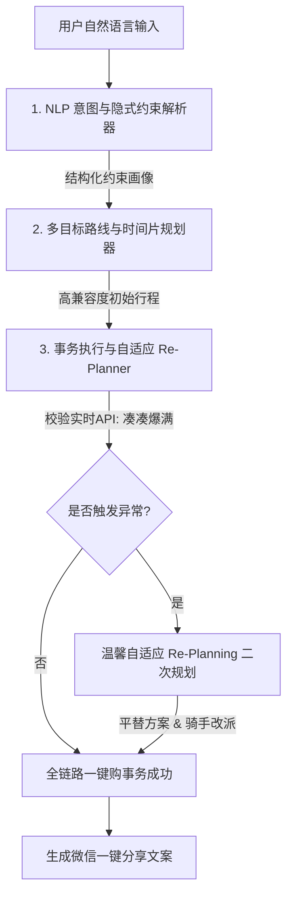

# 美团周末超级管家：一键式“帮你把事情做完”短时场景 Agent 白皮书

## 1. 核心定位与创新痛点

在传统的“本地生活服务”中，用户的决策路径极其碎片化：
* **碎片化规划**：用户需要分别在不同平台或美团不同入口寻找景点、对比餐厅、计算两点间路耗、预估排队时间。
* **多画像隐式约束冲突**：例如“带5岁娃和减肥老婆”出行，用户需要人工筛选具备“亲子属性”且“少油低卡”的商圈组合，极度烧脑。
* **突发状况响应脆弱**：当高兴地驱车到达餐厅时，现场排队 110 分钟。此时行程崩溃，用户需要临时重新决策，体验极差。
* **执行断层**：即使订好行程，用户仍需分别购买景点门票、锁定餐厅卡座、呼叫美团闪购购买防晒霜或阻断剂，缺少“全链路事务一致性”。

**“美团周末超级管家”** 针对性地推出了**“一键式全包温馨智能规划与自动执行（Doer Agent）”**方案。它不再是一个仅仅停留在“给建议”层面的对话框，而是拥有**多维画像解析、自适应多目标路线规划、以及具备 API 异常捕获与 Re-Planning（温馨自适应重规划）**能力的“真·行动派”家庭小管家。

---

## 2. 智能 Agent 三层大脑架构设计

为了实现从“自然语言输入”到“全链路一键自动落地”的闭环，Demo 内部部署了极具学术与工程含金量的**三层大脑架构**：

### 2.1 第一层：NLP 意图与隐式约束解析层
* **工作机制**：解析器通过轻量化 NLP 引擎（Mock 高性能大模型）对输入 query 进行意图挖掘与画像拆解。
* **隐式画像提取**：
  * 输入“带娃/宝/儿童” ──> 自动解构出 `hasChild: true`，开启游玩场景的安全筛查与就餐的儿童餐/宝宝友好筛查。
  * 输入“减肥/轻食/卡路里” ──> 自动解构出 `hasSlimming: true`，强制开启低脂轻食无糖餐饮过滤，不适配度极高的重油盐餐厅将被直接排除。
  * 输入“朋友/桌游/聚会” ──> 自动解构出 `isFriendsGroup: true`，提升社交酒吧、剧本杀、密室的推荐权重。
* **时空边界锁定**：提取时间长度约束（如“几小时”）和空间物理距离阈值（如“3公里内”）。

### 2.2 第二层：多目标路线与时空切片规划层
* **多目标贪心算法**：
  基于两点间真实拓扑距离（通过几何映射 0-5 公里商圈坐标）与用户画像匹配度，对候选节点进行多维度打分：
  $$\text{Score} = w_1 \cdot \text{Compatibility} - w_2 \cdot \text{Distance} - w_3 \cdot \text{QueueWait}$$
  * 在游玩节点（Play）推荐上，带娃家庭优先匹配“亲子乐园/高安全性”；年轻社交圈优先匹配“极客密室/网红桌游”。
  * 在就餐节点（Eat）推荐上，严格加权卡路里、少油低盐属性，且计算游玩点到就餐点的空间耗时。
* **美团生态链协同 ── 智能提前取号**：
  Agent 会获取实时就餐排队时间 $T_{\text{queue}}$，并计算游玩点到餐厅的交通耗时 $T_{\text{travel}}$。若 $T_{\text{queue}} > $T_{\text{travel}}$，Agent 会在用户仍在游玩时，**自动提前 $\Delta T = T_{\text{queue}} - T_{\text{travel}}$ 分钟在美团线上取号**，确保用户抵达餐厅时无需等待即可直接入座。

### 2.3 第三层：事务执行与自适应 Re-Planning（温馨重规划）层
这是 Demo 最具科技含金量与答辩冲击力的核心设计：
* **一键全包事务（Atomic Transaction）**：
  包含购买景点门票、预订餐厅席位/取号、派发美团闪购/买药订单。在执行时采用异步步进式流程，在 UI 上形成温馨管家“小美”的拟人化心声旁白。
* **自适应 Re-Planning 机制**：
  当 Agent 发现当前就餐点遭遇极端突发拥堵（例如“凑凑火锅前方排号 48 桌，预计等待 110 分钟”），Agent 自动触发 **API EXCEPTION** 拦截，不向用户抱怨，而是瞬间在 1.2 秒内完成以下工作流：
  1. **自动中断**原餐厅就餐订单。
  2. **发起温馨二次规划**，锁定同商圈内满足画像限制、且无需排队的“青藤小院禅意轻食馆”。
  3. **重算时空路耗与时间轴**，在 UI 上完成节点无缝平替刷新。
  4. **美团闪购协同重定向**：向美团闪购骑手自动派发目的地修改指令（将原送往凑凑的白芸豆阻断片改送往青藤小院）。
  5. 生成包含新路线的完美闭环微信分享文案。

---

## 3. 前端温馨手账与大厂级视觉美学设计

为了消除冰冷浮夸的“AI 科技感”，Demo 界面严格遵循了**温馨治愈的暖奶茶燕麦色系**移动端布局：

* **温馨奶茶燕麦色系（Oatmeal & Milk Tea Theme）**：
  底色选用极致温润舒缓的浅暖橘粉与米白色渐变，卡片采用纯白大厂拟物风格，辅以柔和微细的咖啡色边框（`border-darkbg-border`），营造极其舒适的家庭化温度。
* **高德地图 API 适配容器 (`MapContainer`)**：
  提供真实的高德挂载视口并完美支持 `AMap` 探测初始化。未加载类库时，优雅降级为清爽、温馨（纯白圆底、暖金线条、灰褐色 Marker）的商圈数字孪生拓扑，完美适应离线演示与实战真机双环境。
* **温馨智能管家语音泡 (`Warm Assistant Bubble`)**：
  彻底移除冷冰冰的代码终端。将 Agent 执行中的思考逻辑（CoT）包装成管家“小美”的温馨对话气泡（支持打字机流式刷新），以饱含人情味、高情商的商业产品文案，向评委展示极强的人性化关怀与生产落地性。
* **积木手账式时间轴卡片 (`Timeline Cards`)**：
  * **一键换一换**：点击卡片旁的“换一换”，Agent 立即在空间限制内随机检索并平替单个节点，时间轴与地图同步无缝刷新。
  * **对调吃玩顺序**：提供“对调吃玩”快捷键。当调换时，Agent 自动前置就餐时间，避开高峰排队，管家小美同步输出暖心避峰日志。

---

## 4. 商业价值与推广前景

1. **大幅度拉升客单价（Multi-order Bundle Buy）**：
   将单次、孤立的消费行为，打包为“玩 + 吃 + 闪购/买药”的多订单全包套餐。一键全包下单直接拉动生态链关联消费。
2. **美团核心跑腿协同（Instant Grocery Co-delivery）**：
   将“即时零售”与“本地短时玩乐”完美编排。如减肥用户就餐时配送阻断片、浪漫约会时配送鲜花。这是只有美团生态才能打通的闭环优势。
3. **极强的高并发避峰与商圈导流效应**：
   通过 Agent 自动进行避峰重规划，将处于“爆满排队”的商圈流量自适应地导流给周边高品质、低负荷的商家，帮助美团商家生态实现科学削峰填谷。
